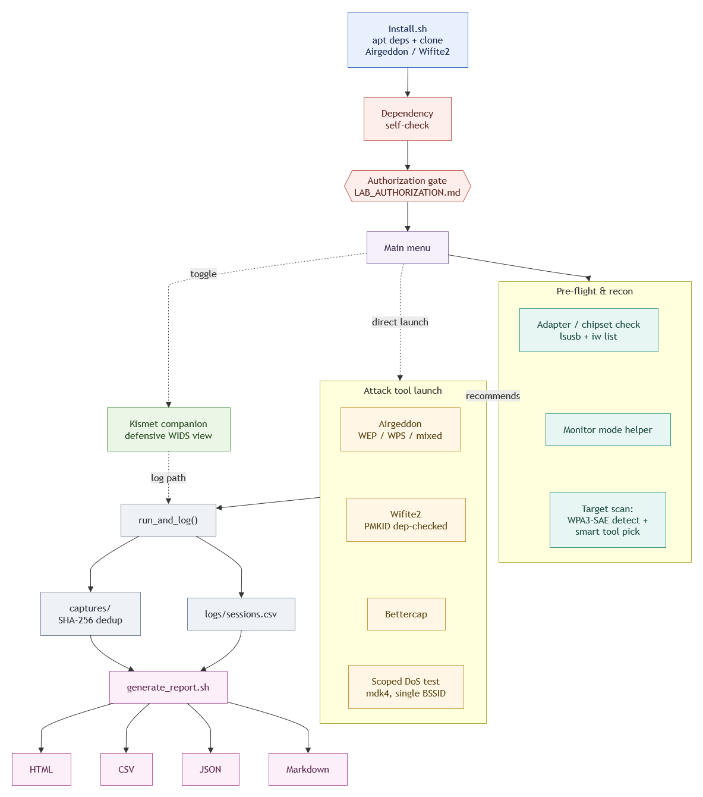

# BlackOps Wireless

A self-contained lab for practicing wireless security auditing with
[Airgeddon](https://github.com/v1s1t0r1sh3r3/airgeddon), Wifite, and
Bettercap on Kali Linux. Clone it, run one install script, and you get a
menu-driven launcher for all three tools.

> **This is for testing networks/devices you own or are explicitly
> authorized to test -- your own home WiFi, a dedicated test AP, or a
> client engagement with signed scope.** See `LAB_AUTHORIZATION.md`.
> Attacking networks you don't own or lack authorization for is illegal
> in most jurisdictions (e.g. unauthorized access / wireless interference
> laws). `lab.sh` will ask you to confirm this every time you launch a
> tool -- don't just click through it, actually mean it.

## Architecture



## What's in here

| File | Purpose |
|---|---|
| `install.sh` | Installs the aircrack-ng toolchain + related apt packages, clones Airgeddon and Wifite2 into `tools/`. |
| `lab.sh` | Interactive menu: dependency check -> authorization gate -> monitor mode check -> launch Airgeddon / Wifite / Bettercap. |
| `LAB_AUTHORIZATION.md` | Fill this out first. Defines what's in scope. |
| `SETUP_NOTES.md` | VM + USB WiFi adapter passthrough (VirtualBox/VMware), monitor-mode verification. |
| `generate_report.sh` | Builds a markdown report from `logs/sessions.csv` + `captures/`, cross-referenced against the scope table in `LAB_AUTHORIZATION.md`. |
| `tools/` | Where Airgeddon/Wifite2 get cloned (git-ignored, populated by `install.sh`). |
| `logs/`, `captures/`, `reports/` | Created automatically by `lab.sh` -- session log, harvested capture files, generated reports (all git-ignored). |

## Quick start (on Kali)

```bash
git clone https://github.com/raju4199/BlackOps-Wireless.git
cd BlackOps-Wireless
sudo ./install.sh      # installs deps + clones airgeddon/wifite2 into tools/
```

Then, before touching anything:

1. Open `LAB_AUTHORIZATION.md` and fill in section 1-5 for your setup.
2. Read `SETUP_NOTES.md` and pass your USB WiFi adapter into the VM.
3. Run the launcher:

```bash
sudo ./lab.sh
```

On launch, `lab.sh` prints a banner and runs an Airgeddon-style dependency
self-check (same idea as Airgeddon's own startup screen -- every required
tool listed as OK/MISSING), then requires you to type
`I CONFIRM AUTHORIZATION` before showing the menu. From there you can:

- check dependencies again any time
- check/enable monitor mode on your adapter (with an automatic rfkill-unblock retry if the first attempt fails)
- launch Airgeddon (full menu-driven WPA/WPS/handshake/eviltwin suite)
- launch Wifite (automated handshake/PMKID capture -- pre-checks hashcat/hcxdumptool/hcxpcapngtool first and warns instead of letting it hang if they're missing)
- launch Bettercap
- generate a session report (now also emits JSON + CSV alongside the markdown)
- re-run the installer to pull tool updates
- run an **adapter/chipset pre-flight check** (`lsusb` + `iw list` cross-referenced against known-good chipsets like Atheros AR9271/RTL8812AU/8811AU and commonly-broken ones like Broadcom/RTL8188EUS)
- **scan a target and get a WPA3-aware tool recommendation**: classifies each beacon as WEP/OPEN/WPA2/WPA2-WPA3-mixed/WPA3-SAE (+ WPS), warns when a network is pure WPA3-SAE (PMF blocks deauth, so deauth-based capture in either tool won't work against it), and suggests whether Airgeddon or Wifite2 fits better
- toggle **Kismet companion mode**, which runs Kismet alongside whichever tool you launch so the session also gets a defensive/WIDS view (rogue AP / deauth-flood alerts) of the same traffic, logged and referenced in the report

Every tool launch is logged to `logs/sessions.csv` (session ID, tool,
start/end time, interface, exit code, Kismet log path), and any
`.cap`/`.pcap`/`.pcapng`/`.hccapx`/`.22000` files created during that
session are automatically moved into `captures/<session-id>/` so nothing
is scattered across `tools/airgeddon` or `tools/wifite2`. Files are
SHA-256 hashed against a manifest (`captures/.manifest.tsv`) so a handshake
or PMKID capture already recorded in an earlier session doesn't get
duplicated. Run option 7, or `./generate_report.sh` directly, to turn all
of this into a markdown report under `reports/` (plus matching `.json`,
`-sessions.csv`, and `-captures.csv` files) that also echoes the current
authorized scope from `LAB_AUTHORIZATION.md`.

## Updating tools later

```bash
sudo ./install.sh
```

`install.sh` is idempotent -- safe to re-run any time; it `git pull`s
Airgeddon/Wifite2 instead of re-cloning, and `apt install` no-ops on
already-installed packages.

## Why a script instead of "just install airgeddon"

Airgeddon itself checks its dependencies on launch and tells you what's
missing, but on a fresh Kali VM you'll usually be missing a handful of
packages (mdk4, hcxtools, reaver/bully, etc.) and doing that one-by-one
is tedious. `install.sh` gets a fresh VM to a working state in one pass,
and `lab.sh` bakes the "did you actually confirm you're authorized to do
this" step into the workflow instead of leaving it as a README note
nobody rereads.

## Uninstall / cleanup

```bash
rm -rf tools/          # removes cloned airgeddon/wifite2
```

The apt packages installed are common, broadly-used networking/security
tools; remove individually with `apt remove <pkg>` if you don't want them
on the system afterward.
