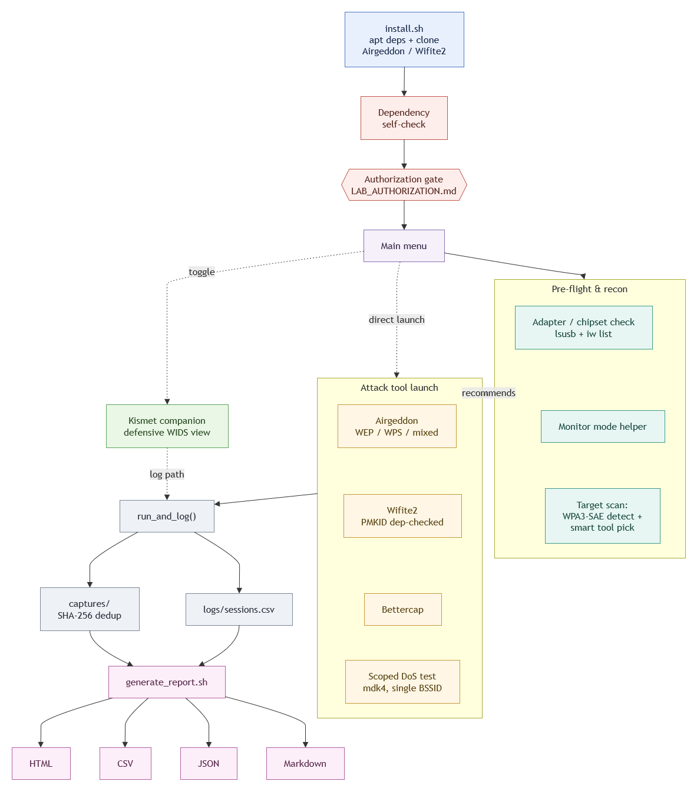

# BlackOps Wireless

A self-contained lab for practicing wireless security auditing with
[Airgeddon](https://github.com/v1s1t0r1sh3r3/airgeddon), Wifite, and
Bettercap on Kali Linux. Clone it, run one install script, and you get a
menu-driven launcher for all three tools.

> **This is for testing networks/devices you own or are explicitly
> authorized to test -- your own home WiFi, a dedicated test AP, or a
> client engagement with signed scope.** See `LAB_AUTHORIZATION.md`.
> Attacking networks you don't own or lack authorization for is illegal
> in most jurisdictions (e.g. unauthorized access / wireless interference
> laws). `lab.sh` will ask you to confirm this every time you launch a
> tool -- don't just click through it, actually mean it.

## Architecture



## What's in here

| File | Purpose |
|---|---|
| `install.sh` | Installs the aircrack-ng toolchain + related apt packages, clones Airgeddon and Wifite2 into `tools/`. |
| `lab.sh` | Interactive menu: dependency check -> authorization gate -> monitor mode check -> launch Airgeddon / Wifite / Bettercap. Includes a **guided workflow** that runs the steps in the correct order. |
| `lib/ui.sh` | Shared terminal UI toolkit (boxed headers, colour-coded severity badges, aligned tables, signal-strength bars). Purely presentational; degrades to plain ASCII when piped to a file or when `NO_COLOR` is set. |
| `LAB_AUTHORIZATION.md` | Fill this out first. Defines what's in scope. |
| `SETUP_NOTES.md` | VM + USB WiFi adapter passthrough (VirtualBox/VMware), monitor-mode verification. |
| `generate_report.sh` | Builds a markdown report from `logs/sessions.csv` + `captures/`, cross-referenced against the scope table in `LAB_AUTHORIZATION.md`. |
| `tools/` | Where Airgeddon/Wifite2 get cloned (git-ignored, populated by `install.sh`). |
| `logs/`, `captures/`, `reports/` | Created automatically by `lab.sh` -- session log, harvested capture files, generated reports (all git-ignored). |

## Installation on Kali Linux

### Prerequisites

- **Kali Linux** (bare metal or a VM). The installer targets Kali/Debian
  `apt`; it will warn but continue on other Debian-based distros.
- **Root / sudo** access.
- A **monitor-mode + injection capable USB WiFi adapter** (e.g. Atheros
  AR9271, Realtek RTL8812AU/8811AU, Ralink RT3070). Onboard laptop WiFi
  behind a VM almost never works -- see [`SETUP_NOTES.md`](SETUP_NOTES.md).
- `git` (ships with Kali; `sudo apt install -y git` if missing).

### Step 1 -- Get the code

```bash
git clone https://github.com/raju4199/BlackOps-Wireless.git
cd BlackOps-Wireless
```

### Step 2 -- Run the installer

```bash
sudo ./install.sh
```

This installs the aircrack-ng toolchain and everything Airgeddon / Wifite /
Bettercap expect (mdk4, hcxtools, hcxdumptool, reaver, bully, hashcat,
kismet, ...), then clones Airgeddon and Wifite2 into `tools/`. It's
**idempotent** -- re-run it any time to pull tool updates. Full log goes to
`install.log`.

If any package fails (e.g. not in your repos), the installer lists it at the
end and keeps going; Airgeddon re-checks its own dependencies on launch too.

### Step 3 -- Define your scope

```bash
nano LAB_AUTHORIZATION.md      # fill in sections 1-5
```

Put your **test AP's SSID and BSSID** in the section 2 scope table
(`AA:BB:CC:DD:EE:FF` format). The scoped DoS/resilience test refuses to run
until this is filled in, and reports echo this scope so results stay
traceable.

### Step 4 -- Attach your adapter & verify monitor mode

Pass your USB adapter into the VM (see [`SETUP_NOTES.md`](SETUP_NOTES.md)),
then confirm it's visible:

```bash
iw dev                                                # a wlanX interface exists
iw list | grep -A10 "Supported interface modes"       # look for "monitor"
```

### Step 5 -- Launch

```bash
sudo ./lab.sh
```

> **Tip:** for a fresh run, just pick **option 13 (Guided pentest
> workflow)** -- it walks every step below in the correct order.

## How to use it

On launch, `lab.sh` prints a banner and runs an Airgeddon-style dependency
self-check (same idea as Airgeddon's own startup screen -- every required
tool listed as OK/MISSING), then requires you to type
`I CONFIRM AUTHORIZATION` before showing the menu. From there you can:

- check dependencies again any time
- check/enable monitor mode on your adapter (with an automatic rfkill-unblock retry if the first attempt fails)
- launch Airgeddon (full menu-driven WPA/WPS/handshake/eviltwin suite)
- launch Wifite (automated handshake/PMKID capture -- pre-checks hashcat/hcxdumptool/hcxpcapngtool first and warns instead of letting it hang if they're missing)
- launch Bettercap
- generate a session report (now also emits JSON + CSV alongside the markdown)
- re-run the installer to pull tool updates
- run an **adapter/chipset pre-flight check** (`lsusb` + `iw list` cross-referenced against known-good chipsets like Atheros AR9271/RTL8812AU/8811AU and commonly-broken ones like Broadcom/RTL8188EUS)
- **scan a target and get a WPA3-aware tool recommendation**: classifies each beacon as WEP/OPEN/WPA2/WPA2-WPA3-mixed/WPA3-SAE (+ WPS), warns when a network is pure WPA3-SAE (PMF blocks deauth, so deauth-based capture in either tool won't work against it), and suggests whether Airgeddon or Wifite2 fits better
- toggle **Kismet companion mode**, which runs Kismet alongside whichever tool you launch so the session also gets a defensive/WIDS view (rogue AP / deauth-flood alerts) of the same traffic, logged and referenced in the report
- run the **guided pentest workflow** (menu option 13), which walks you through the whole engagement in the right order (authorize -> adapter pre-flight -> monitor mode -> recon -> pick target/tool -> harvest captures -> report) so nothing runs out of sequence

## Reading the recon output

The scan (menu option 10, or step 4 of the guided workflow) doesn't just
list APs -- it rates each one and sorts the table worst-first, so the
networks that actually need attention are at the top:

```
  SEVERITY   BSSID             ESSID              CH   SIGNAL  ENCRYPTION / WPS
────────────────────────────────────────────────────────────────
   CRITICAL  AA:BB:CC:00:00:01 CoffeeShop         6    ████░  OPEN
   CRITICAL  AA:BB:CC:00:00:06 OldPrinter         3    █░░░░  WEP
  [  HIGH  ] AA:BB:CC:00:00:02 Home_2G            11   ███░░  WPA2 +WPS
  [ MEDIUM ] AA:BB:CC:00:00:03 Office             1    ██░░░  WPA2
  [  LOW   ] AA:BB:CC:00:00:04 NewRouter          36   ████░  WPA2/WPA3-mixed
  [ SECURE ] AA:BB:CC:00:00:05 Secure_AP          44   ████░  WPA3-SAE
```

Below the table it prints a findings tally and a **Priority findings**
panel that, for each CRITICAL/HIGH/MEDIUM network, explains *why* it's
flagged and which installed tool fits the attack path.

### Severity model

| Severity | Meaning | Typical networks |
|---|---|---|
| **CRITICAL** | No or broken encryption -- anyone in range gets in | OPEN, WEP |
| **HIGH** | A practical attack path bypasses the passphrase | WPS PIN/Pixie-Dust, WEP key recovery |
| **MEDIUM** | Crackable only if the passphrase is weak | WPA2-PSK (handshake/PMKID capture) |
| **LOW** | Hardened but with a known caveat | WPA2/WPA3 transition (downgrade) |
| **SECURE** | No attack path exposed here | WPA3-SAE + PMF |

The same rating logic (`severity_for` in `lab.sh`) drives both the table
and the priority panel, so they never disagree.

Every tool launch is logged to `logs/sessions.csv` (session ID, tool,
start/end time, interface, exit code, Kismet log path), and any
`.cap`/`.pcap`/`.pcapng`/`.hccapx`/`.22000` files created during that
session are automatically moved into `captures/<session-id>/` so nothing
is scattered across `tools/airgeddon` or `tools/wifite2`. Files are
SHA-256 hashed against a manifest (`captures/.manifest.tsv`) so a handshake
or PMKID capture already recorded in an earlier session doesn't get
duplicated. Run option 7, or `./generate_report.sh` directly, to turn all
of this into a markdown report under `reports/` (plus matching `.json`,
`-sessions.csv`, and `-captures.csv` files) that also echoes the current
authorized scope from `LAB_AUTHORIZATION.md`.

## Updating tools later

```bash
sudo ./install.sh
```

`install.sh` is idempotent -- safe to re-run any time; it `git pull`s
Airgeddon/Wifite2 instead of re-cloning, and `apt install` no-ops on
already-installed packages.

## Why a script instead of "just install airgeddon"

Airgeddon itself checks its dependencies on launch and tells you what's
missing, but on a fresh Kali VM you'll usually be missing a handful of
packages (mdk4, hcxtools, reaver/bully, etc.) and doing that one-by-one
is tedious. `install.sh` gets a fresh VM to a working state in one pass,
and `lab.sh` bakes the "did you actually confirm you're authorized to do
this" step into the workflow instead of leaving it as a README note
nobody rereads.

## Uninstall / cleanup

```bash
rm -rf tools/          # removes cloned airgeddon/wifite2
```

The apt packages installed are common, broadly-used networking/security
tools; remove individually with `apt remove <pkg>` if you don't want them
on the system afterward.
